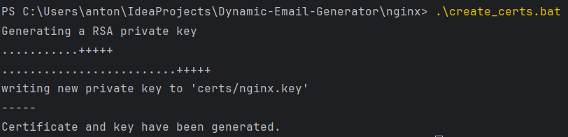
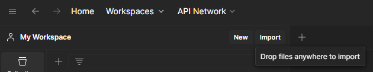
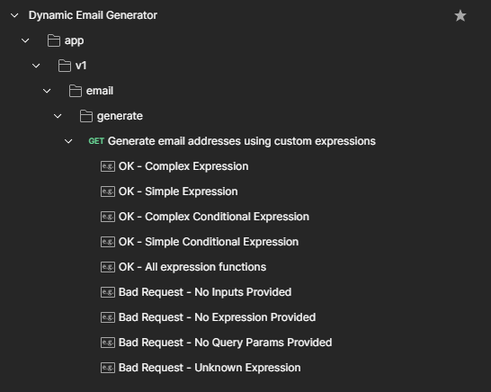

# Dynamic Email Generator

# Contents

1. [Introduction](#introduction)
2. [Technologies Used](#technologies-used)
3. [Setup Instructions](#setup-instructions)
    - [Certificates](#certificates)
    - [Nginx Reverse Proxy Configuration](#nginx-reverse-proxy-configuration)
    - [Running the docker-compose Bundle Locally](#running-the-docker-compose-bundle-locally)
4. [Custom Expression Language](#custom-expression-language)
5. [API Endpoints](#api-endpoints)
    - [Postman Collection](#postman-collection)
    - [Generate Emails](#generate-emails)
        - [Request Query Parameters](#request-query-parameters)
        - [Responses](#responses)
        - [Usage Notes](#usage-notes)
        - [Sample Requests](#sample-requests)
6. [Extending the Custom Expression Language](#extending-the-custom-expression-language)

## Introduction

The Dynamic Email Generator is a service powered by the Spring Boot framework, offering a RESTful API to create
personalized email addresses. Through a custom expression language, users can define rules to generate email addresses
based on specific criteria and custom methods.

The service has a reverse Nginx proxy at the front, with the whole setup configured inside a docker-compose file for
easy setup.

## Technologies Used

- Java 21
- Spring Boot 3
- Nginx
- Docker
- Postman

## Setup Instructions

Note: The following instructions were written and tested on a _Windows 10_ system

### Certificates

To create the self-signed certificates needed for the Nginx reverse proxy configuration, you must
have [OpenSSL](https://github.com/openssl/openssl) installed on your system.
You most likely already have it in you git installation folder ```("C:\Program Files\Git\usr\bin\openssl.exe")``` just
add it to PATH.

After installing OpenSSL (and placing it on your [PATH](https://www.java.com/en/download/help/path.html)) you have 2
options:

1. Navigate to <project root>\nginx
2. Open a CMD window in that location
3. Run ```.\create_certs.bat```
   

Or manually:

1. Open a CMD window
2. Navigate to the "**\nginx**" folder in project root directory
3. Create a "**\certs**" directory, run ```mkdir certs```
4. To generate a self-signed certificate
   run ```openssl req -x509 -nodes -days 365 -newkey rsa:2048 -keyout certs/nginx.key -out certs/nginx.crt -subj "/C=US/ST=Denial/L=Springfield/O=Dis/CN=www.localhost.com"```

In both cases you will end up with a **.crt** and **.key** file in the **\nginx\certs** directory.

Note that they are referenced in [docker-compose.yml](docker-compose.yml) and [nginx.conf](nginx/nginx.conf) and must be
updated in both places if a name/location change occurs.

### Nginx Reverse Proxy Configuration

All the nginx-related configurations can be found under [/nginx](/nginx).
This includes certificates, custom error pages, helper scripts and most importantly - [nginx.conf](nginx/nginx.conf).

The important aspects of the proxy configuration are:

* SSL certificate locations (referenced in [docker-compose](/docker-compose.yml))
   ```nginx configuration
   ssl_certificate /etc/nginx/certs/nginx.crt;
   ssl_certificate_key /etc/nginx/certs/nginx.key;
   ```
* Error page config (referenced in [docker-compose](/docker-compose.yml))
    ```nginx configuration
     # Capture unexpected errors gracefully
    error_page 500 502 503 504 /50x.html;
    location = /50x.html {
        root /usr/share/nginx/html;
        internal;
    }
    ```
* ```location``` configs - the configuration is strict, only exposing the endpoints that are relevant for operation,
  preventing external users from hitting different service locations
    * ```location /app``` - api prefix
    * ```location /swagger-ui``` - needed for swagger ui
    * ```location /v3``` - needed for swagger ui

Note: Nginx is exposed on port ```9443```, but listening on ```443``` internally, and if this has to be
changed, [docker-compose](/docker-compose.yml) has to be
updated to reflect the change, also [nginx.conf](nginx/nginx.conf) location objects must be updated with the new port,
namely ```proxy_set_header X-Forwarded-Port 9443;```

### Running the docker-compose Bundle Locally

To run the configuration described inside the [docker.compose.yml](docker-compose.yml), you must
have [Docker](https://docs.docker.com/engine/install/) installed on your system.

Build the project before creating a Docker image:

1. Run a ```mvn clean verify``` on the project
2. After all tests have passed, you should see a success build

After installing Docker:

1. Open a CMD window
2. Navigate to the project root directory
3. Run the compose file, recreating any containers and forcing a rebuild
    * ```docker-compose up --force-recreate --no-deps --build```
4. Clean up dangling containers (if any) produced by the previous command
    * ```docker image prune -f```

This will build the new service Docker image described in the [Dockerfile](Dockerfile), run it, and pull and run the
Nginx image serving as a reverse proxy.

Verify that you can hit the API swagger page at https://localhost:9443/swagger-ui/index.html

## Custom Expression Language

Assume inputs:

```
str1=Ivan
str2=Petar
str3=Falcon
```

| Operation/Expression                  | Description                                                                                                                 |
|---------------------------------------|-----------------------------------------------------------------------------------------------------------------------------|
| first(str1,N)                         | evaluates to the first N chars of the input parameter                                                                       |
| last(str1,N)                          | evaluates to the last N chars of the input parameter                                                                        |
| substr(str1, N start, N end)          | evaluates to the substring between **start(inclusive)** and **end(exclusive)** indexes                                      |
| lit(str1)                             | literal expression, simply evaluates to the value of str1 key                                                               |
| raw(.com)                             | evaluates to a raw string: ".com" in the example                                                                            | 
| lit(str1) ; raw(.com)                 | concatenation is done using a ";" semicolon                                                                                 |
| longer(lit(str1),lit(str2),lit(str3)) | if first expression parameter is longer than second expression parameter -> execute third expression, if not - empty string |
| eq(lit(str1),lit(str2),lit(str3))     | if first expression parameter is equal to second expression parameter -> execute third expression , if not - empty string   | 

## API Endpoints

### Postman Collection

A postman collection that covers basic API usage can be found
in [/postman](/postman/Dynamic%20Email%20Generator.postman_collection.json) folder in the project root directory.

To import the collection:

1. Open Postman
2. Click on "import" on the left 
3. Drag and drop the collection from [/postman](/postman/Dynamic%20Email%20Generator.postman_collection.json) directory
4. Explore the stored requests 

### Generate Emails

**Endpoint**: `GET /app/v1/email/generate`

This endpoint dynamically generates email addresses with the use of
a [Custom Expression Language](#custom-expression-language) and a set of input parameters.
It's designed to process complex rules defined in the 'expression' parameter and apply them to the inputs provided.

#### Request Query Parameters:

- **expression** (required): A string parameter defining the rules for generating emails. It must be a single, non-empty
  string. The rules are defined [here](#custom-expression-language).
- **strN**: Additional parameters with keys starting with `str` followed by any number (
  e.g., `str1=test`, `str2=string`). These parameters are used as inputs for the `expression` defined.

#### Responses:

- **200 OK**:
    - **Content-Type**: `application/json`
    - **Body**: An `ApiResponse` object containing a list of generated emails.
    - **Example**:
      ```json
      {
          "data": [
              "Iva@mail.com",
              "Iva@mail.com",
              "Iva@ahoo.com",
              "Iva@ahoo.com",
              "Pet@mail.com",
              "Pet@mail.com",
              "Pet@ahoo.com",
              "Pet@ahoo.com",
              "testRad@mail.com",
              "domainRad@mail.com",
              "testRad@ahoo.com",
              "domainRad@ahoo.com"
          ],
          "message": null
      }
      ```

- **400 Bad Request**:
    - Occurs when:
        - The `expression` parameter is missing, empty, or multiple expressions are provided.
        - Any parameter key does not start with `str`.
        - Invalid expression format according to the [Custom Expression Language](#custom-expression-language)
          definition
    - **Content-Type**: `application/json`
    - **Body**: An `ApiResponse` object containing an error message.
    - **Example**:
      ```json
      {
        "data": null,
        "message": "An 'expression' string is required."
      }
      ```

#### Usage Notes:

- The endpoint strictly requires at least two query parameters: one `expression` and at least one input parameter
  prefixed with `str`. This ensures that there is at least one rule and one input to apply the rule to.
- The endpoint is designed to be robust against invalid input formats and will provide descriptive error messages to
  assist in correcting request formats.

#### Sample Requests:

```bash
curl -X 'GET' \
  'http://localhost:8080/app/v1/email/generate?str1=Ivan&str1=Petar&str1=Rado&str2=gmail&str2=yahoo&expression=first(str1, 3);raw(@);last(str2,4);raw(.com)' \
  -H 'accept: application/json'
```

```bash
curl -X 'GET' \
  'http://localhost:8080/app/v1/email/generate?expression=longer(lit(str1),lit(str2),lit(str3));first(str1, 3);raw(@);last(str2,4);raw(.com);eq(lit(str1),lit(str2),raw(.bg))&str1=Ivan&str1=Petar&str1=Radooo&str2=gmail&str2=yahoo&str3=test&str3=domain' \
  -H 'accept: application/json'
```

## Extending the Custom Expression Language

The [Custom Expression Language](#custom-expression-language) can be further extended with new expression methods very
easily. The reason for that is the use of
the [Interpreter Design Pattern](https://en.wikipedia.org/wiki/Interpreter_pattern) at the core of the project.

The simplest form of a new terminal expression:

```java

@RequiredArgsConstructor
class SomeNewExpression implements Expression {
	private final String inputKey;

	@Override
	public String interpret(Context ctx) {
		String input = ctx.getValue(inputKey);
		String result = doSomeNewStringManipulation(input);
		return result;
	}
}
```

The simplest form of a new non-terminal expression

```java

@RequiredArgsConstructor
class SomeComplexConditionalExpression implements Expression {
	private final Expression left;
	private final Expression right;
	private final Expression actionWhenTrue;
	private final Expression actionWhenFalse;

	@Override
	public String interpret(Context ctx) {
		if (left.interpret(ctx).equals(right.interpret(ctx))) {
			return actionWhenTrue.interpret(ctx);
		}
		return actionWhenFalse;
	}
}
```

As you can see new expressions can be defined incredibly easy, you just have to stick to these steps:

1. Define a new expression method keyword, for example ```len()```
2. Create a new enum entry for the new expression keyword
   in [Operations](src/main/java/com/stdnullptr/emailgenerator/service/interpreter/Operations.java) enum
    * ```LEN("len")```
3. Create a new Expression class in the [interpreter](src/main/java/com/stdnullptr/emailgenerator/service/interpreter)
   package
4. Add a new case in the operation switch
   inside [InterpreterService](src/main/java/com/stdnullptr/emailgenerator/service/interpreter/InterpreterService.java)
   instantiating a new Expression from the newly created Expression class
5. Add proper tests, update documentation,
   update [postman](/postman/Dynamic%20Email%20Generator.postman_collection.json) collection

That's it! In these short few steps you can add new expressions to the interpreter.