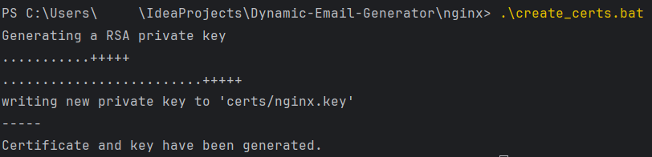

# Dynamic Email Generator

## Introduction
The Dynamic Email Generator is a service designed to create customized email addresses based on user-defined rules.
It utilizes Spring Boot framework to serve dynamically generated email addresses through a RESTful API.

The generation is customized by using a custom expression language, described below.

## Technologies Used
- Java 21
- Spring Boot 3
- Nginx
- Docker

## Setup Instructions
Note: The following instructions were tested on a _Windows 10_ system

### Certificates
To create the self-signed certificates needed for the Nginx proxy configuration, you must have [OpenSSL](https://github.com/openssl/openssl) installed on your system.
You most likely already have it in you git installation folder ```("C:\Program Files\Git\usr\bin\openssl.exe")``` just add it to PATH.

After installing OpenSSL (and placing it on your [PATH](https://www.java.com/en/download/help/path.html)) you have 2 options:
1. Navigate to <project root>\nginx
2. Open a CMD window in that location
3. Run ```.\create_certs.bat```


Or manually:
1. Open a CMD window
2. Navigate to the **nginx** folder in project root directory
3. Create a "**\certs**" directory, run ```mkdir certs```
4. To generate a self-signed certificate run ```openssl req -x509 -nodes -days 365 -newkey rsa:2048 -keyout certs/nginx.key -out certs/nginx.crt -subj "/C=US/ST=Denial/L=Springfield/O=Dis/CN=www.localhost.com"```

In both cases you will end up with a **.crt** and **.key** file in the **\nginx\certs** directory.

Note that they are referenced in [docker-compose.yml](docker-compose.yml) and [nginx.conf](nginx/nginx.conf) and must be updated in both places if a name/location change occurs.

### Running the docker-compose bundle locally
To run the configuration described inside the [docker.compose.yml](docker-compose.yml), you must have [Docker](https://docs.docker.com/engine/install/) installed on your system.

Build the project before creating a Docker image:
1. Run a ```mvn clean verify``` on the project
2. After all tests have passed, you should see a success build

After installing Docker:
1. Open a CMD window
2. Navigate to the project root directory
3. Make sure you don't have an old image of the service:
   * ```docker-compose build --no-cache```
4. Run ```docker compose up --force-recreate --remove-orphans```

This will build the new service Docker image described in the [Dockerfile](Dockerfile) and pull and run the Nginx image

### (TODO)
## Custom Expression Language
(TODO language rules)

## API Endpoints

### Generate Emails

**Endpoint**: `GET /app/v1/email/generate`

This endpoint dynamically generates email addresses based on a Custom Expression Language and a set of input parameters.
It's designed to process complex rules defined in the expression parameter and apply them to the inputs provided.

#### Request Query Parameters:

- **expression** (required): A string parameter defining the rules for generating emails. It must be a single, non-empty string. (TODO rules)
- **strN**: Additional parameters with keys starting with `str` followed by any number (e.g., `str1=test`, `str2=string`). These parameters are used as inputs for the `expression` defined.

#### Responses:
- **200 OK**:
    - **Content-Type**: `application/json`
    - **Body**: An `ApiResponse` object containing a list of generated emails.
    - **Example**:
      ```json
      {
        "data": ["example1@domain.com", "example2@domain.com"],
        "message": null
      }
      ```

- **400 Bad Request**:
    - Occurs when:
        - The `expression` parameter is missing, empty, or multiple expressions are provided.
        - Any parameter key does not start with `str`.
    - **Content-Type**: `application/json`
    - **Body**: An `ApiResponse` object containing an error message.
    - **Example**:
      ```json
      {
        "data": null,
        "message": "Invalid input parameters. Ensure your request includes a valid 'expression' and all parameter keys start with 'str'."
      }
      ```
#### Usage Notes:

- The endpoint strictly requires at least two query parameters: one `expression` and at least one input parameter prefixed with `str`. This ensures that there is at least one rule and one input to apply the rule to.
- The endpoint is designed to be robust against invalid input formats and will provide descriptive error messages to assist in correcting request formats.

#### Sample Request:

```bash
curl -X GET "https://<host>:<port>/app/v1/email/generate?expression=unique_expression&str1=value1&str2=value2" \
     -H "Accept: application/json"